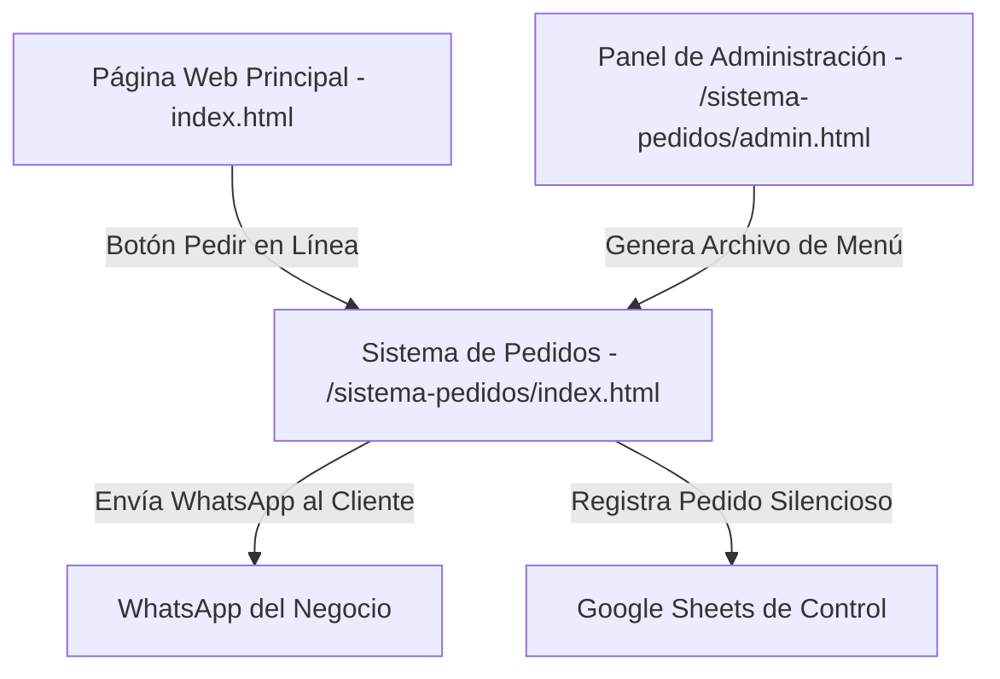

# 📖 Manual de Usuario y Administración
## Barbacoa Tatemada El Vale — Nogales, Sonora

¡Felicidades! Tu sitio web y sistema de pedidos digital están listos y optimizados al más alto nivel. Este manual interactivo te guiará paso a paso sobre cómo funciona tu plataforma, cómo administrar tu menú de platillos de forma visual, cómo funciona la integración con Google Sheets y cómo realizar cambios en imágenes o textos sin complicaciones.

---

## 🗺️ 1. Estructura General de la Plataforma

Tu sistema digital se compone de dos secciones principales y una hoja de administración:



1.  **Página Web Principal (Landing Page):** Es tu escaparate digital (`index.html` en la raíz). Muestra la historia, dirección, mapa interactivo, redes sociales y una galería de fotos reales que despiertan el antojo.
2.  **Sistema de Pedidos Inteligente:** Accesible en `/sistema-pedidos/`. Permite a los clientes elegir sus productos, personalizar su orden (ej. tipo de carne o complementos), rellenar sus datos (Nombre, Teléfono, Fecha de Nacimiento para sorpresas en su cumpleaños, Tipo de entrega, etc.) y enviar su pedido directo a tu **WhatsApp**.
3.  **Panel de Administración Visual:** Accesible en `/sistema-pedidos/admin.html`. Es tu centro de control secreto donde puedes agregar nuevos productos, ajustar precios, marcar productos agotados o populares, y administrar las ligas externas del negocio.

---

## 🍽️ 2. El Sistema de Pedidos y WhatsApp

El flujo de pedidos está diseñado para ser extremadamente intuitivo en teléfonos móviles y tabletas:

1.  **Selección del Menú:** El cliente navega por categorías rústicas (Tacos, Sopes, Órdenes, Bebidas, etc.) y va agregando productos con un solo toque.
2.  **Carrito de Compras Premium:** Un panel lateral (o flotante en celulares) muestra el resumen en tiempo real con su total acumulado.
3.  **Captura Inteligente de Datos (CRM Local):** 
    *   La página **recuerda los datos del cliente** para su próxima visita (así no tienen que escribir su dirección o teléfono cada vez).
    *   Pregunta por la fecha de nacimiento para consentirlos en su cumpleaños.
    *   Permite seleccionar **Entrega a Domicilio** (abriendo el campo de dirección y enlace a Google Maps) o **Recoger en Sucursal**.
    *   Ofrece pagos por **Efectivo** (preguntando con cuánto pagará para sugerir el cambio) o **Transferencia Bancaria** (mostrando tus datos bancarios y permitiéndoles copiar la CLABE con un botón).
4.  **Confirmación y WhatsApp:** Al dar clic en "Enviar Pedido", se procesa la orden, se envía automáticamente al Google Sheets en segundo plano, **se limpia el carrito de compras** para que no se dupliquen pedidos antiguos, y se abre WhatsApp con un mensaje estructurado y listo para enviar.

---

## ⚙️ 3. El Panel de Administración (Paso a Paso)

Para ingresar, simplemente escribe la ruta de tu sitio web seguida de `/sistema-pedidos/admin.html` (por ejemplo: `https://barbacoatatemada.com/sistema-pedidos/admin.html`).

> [!TIP]
> Guarda esta página en tus "Marcadores" o "Favoritos" en tu navegador para ingresar rápidamente desde tu celular o computadora.

### A. Gestión de Catálogo (Menú)
Desde la pestaña principal del panel administrativo, verás una tabla con todos tus platillos actuales. Puedes hacer lo siguiente de manera 100% visual:

*   **Marcar como "Agotado" o "Disponible":** Usa el interruptor de estado (Switch verde/gris) para ocultar o mostrar un platillo en el menú en tiempo real.
*   **Marcar como "Popular ⭐":** Si activas esta casilla, el platillo se destacará en la parte superior del menú digital con una estrella dorada y una etiqueta especial de "¡El más pedido!".
*   **Editar Platillos:** Clic en el botón **Editar (✏️)** para modificar de forma rápida el nombre, descripción, precio, categoría o ruta de imagen.
*   **Eliminar un Producto:** Clic en el botón rojo de bote de basura **(🗑️)**.
*   **Agregar un Nuevo Producto:** Usa el botón de la parte superior **"+ Agregar Producto"**. Rellena el formulario con su nombre, categoría, precio, descripción, si deseas destacarlo y el nombre de la imagen que guardaste previamente en `assets/images/`.

### B. Aplicar Cambios en Vivo (¡Muy Importante!)
Para evitar que se dañe tu menú por error, los cambios que realizas en el panel de administración se guardan temporalmente en tu navegador. **Para hacerlos permanentes en la web en vivo, sigue estos sencillos pasos:**

1.  Realiza todas las modificaciones (agregar, editar, apagar productos) en el Panel Admin.
2.  Ve a la pestaña **"Exportar Menú"** dentro del panel.
3.  Haz clic en el botón azul **"Descargar archivo menu-data.js"**.
4.  Toma ese archivo descargado de tu computadora y colócalo dentro de la carpeta `sistema-pedidos/` de tu proyecto, **reemplazando el archivo anterior**.
5.  *(Opcional)* Si te es más cómodo, puedes hacer clic en **"Copiar código"**, abrir el archivo `menu-data.js` en tu editor, seleccionar todo y pegar el nuevo código.
6.  Sube (haz push) tus archivos actualizados a GitHub para que Vercel actualice la web en vivo en menos de un minuto. ¡Listo!

---

## 📊 4. Integración con Google Sheets

Cada vez que un cliente confirma un pedido, el sistema escribe de forma **silenciosa y automática** los datos en tu hoja de cálculo de Google Drive.

### ¿Cómo configurarlo o cambiar de Hoja de Cálculo?
Si alguna vez necesitas vincular una nueva hoja de cálculo, los pasos son los siguientes:

1.  Abre tu Hoja de Cálculo de Google.
2.  Ve a **Extensiones > Apps Script**.
3.  Pega el código de integración de Google Apps Script (que se encuentra provisto en tu carpeta del proyecto bajo la guía de desarrollo).
4.  Haz clic en **Implementar > Nueva implementación**. Selecciona tipo **"Aplicación Web"**, configura el acceso para **"Cualquiera"** (Even Anyone) y haz clic en Implementar.
5.  Copia la URL que te genera (debe empezar con `https://script.google.com/macros/s/...`).
6.  Ve a tu **Panel de Administración (`admin.html`)** a la pestaña **"Integración Sheets"**.
7.  Pega la URL en el campo correspondiente y haz clic en **"Guardar URL"**.
8.  ¡Listo! El sistema de pedidos ahora enviará todos los datos a esa nueva hoja de cálculo.

---

## 🖼️ 5. Cómo cambiar Imágenes y Textos de la Web

### A. Cambiar imágenes de la Galería Principal ("Directo del fuego...")
Todas las imágenes de la galería del sitio principal se encuentran en la carpeta `assets/images/`.

**Forma 1 (Reemplazo Directo):**
Si quieres cambiar, por ejemplo, la foto de la **Tapatía**, guarda tu nueva foto en formato `.png`, cámbiale el nombre exactamente a `tapatia_barbacoa.png` y reemplaza el archivo actual en la carpeta `assets/images/`.

**Forma 2 (Código HTML):**
Si tu nueva imagen está en otro formato (como `.jpg` o `.webp`), puedes guardar la imagen con cualquier nombre en la carpeta `assets/images/` y modificar el archivo [index.html](file:///Volumes/Programas/1.-%20Archivos%20de%20IA/1.-%20Proyectos%20Personales/1.%20Antigravity/Barbacoa%20Tatemada/index.html) en las líneas **312 a 351**:

```html
<!-- Ejemplo: Cambiar la Tapatía a una imagen JPG -->
<div class="gallery-item" onclick="openModal('assets/images/mi_tapatia_nueva.jpg')">
    
    <div class="gallery-overlay"><span>Ver más grande</span></div>
</div>
```

---

## 🚀 6. Mantenimiento y Actualizaciones en Vivo

Dado que tu sitio web está conectado de forma inteligente a **GitHub** y desplegado en **Vercel**, cualquier cambio de código, imagen, o archivo de menú (`menu-data.js`) se publica en internet en segundos siguiendo estos comandos en la terminal desde la carpeta de tu proyecto:

```bash
# 1. Agrega todos los archivos nuevos y cambiados
git add .

# 2. Crea una nota que describa qué cambiaste (ej. actualizar menú)
git commit -m "feat: actualizar menu de platillos"

# 3. Empuja los cambios a la web
git push origin main
```

¡Eso es todo! En menos de 45 segundos, Vercel compilará la versión más nueva y tus clientes verán el menú fresco, fotos actualizadas y configuraciones al instante.
